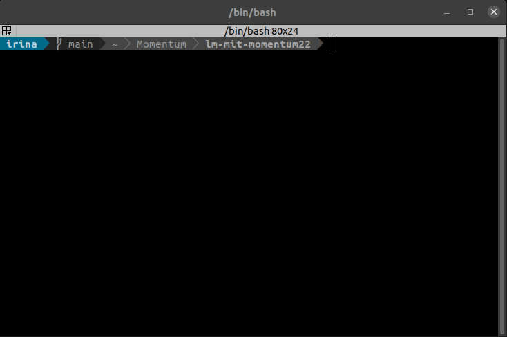
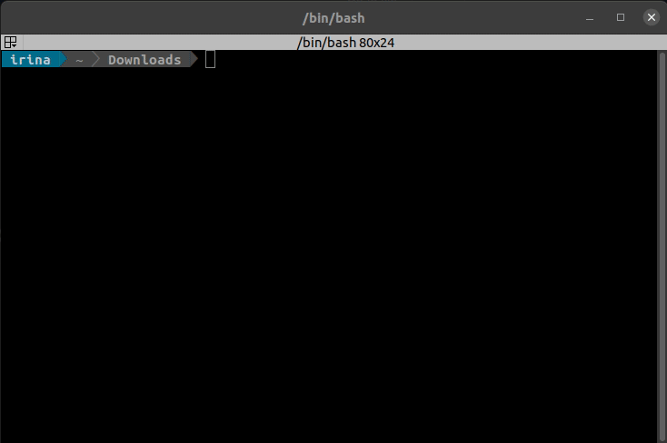
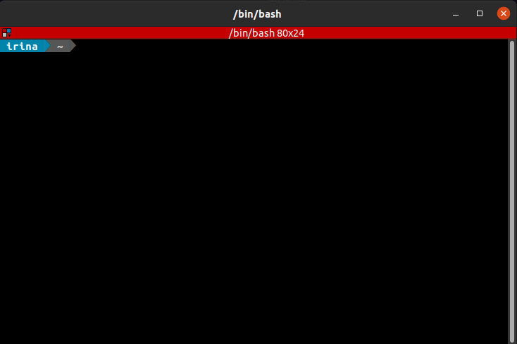
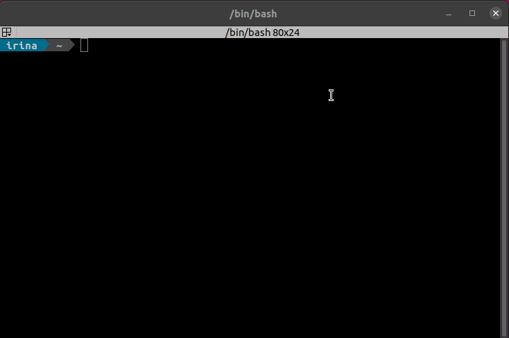
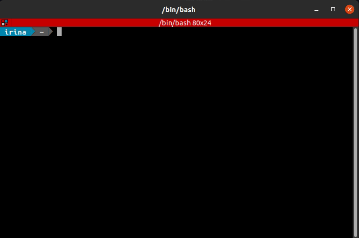

# Getting Started <!-- omit in toc -->

This readme will walk you through getting your environment set up with the required software and running your first missions.

If you are viewing this file offline, the most up to date version of these instructions is located in the [project GitHub](https://github.com/lmco/lm-mit-momentum22).

**NOTES:**<!-- omit in toc -->

1. Unless otherwise specified, all instructions are to be entered into the terminal in your Ubuntu installation
2. Commands that start with `sudo` will require your user password. Using sudo invokes superuser security privileges and is akin to running an application as an administrator in Windows.
3. As we progress through the project, answers to common questions will be added to the [Q&A](https://github.com/lmco/lm-mit-momentum22/blob/main/QA.md).

## Quick references

Note: if you're just getting started, walk through the [steps after the table of contents](#1-install-ubuntu-2004-lts) first!

### How to download this project to your computer

See [Section 8](#8-clone-the-momentum22-project-folder-from-github) for more details.

``` sh
# Create a folder for the Momentum project in your home (~) directory
mkdir -p ~/Momentum

# Change directories to the folder we created
cd ~/Momentum

# Clone the project from GitHub
git clone git@github.com:lmco/lm-mit-momentum22.git

# Pull updates from remote
cd ~/Momentum/lm-mit-momentum22
git pull
```

### How to launch the simulation

See [Section 9.1.](#91-launch-px4-visualizer-and-student-code-with-provided-maps-and-scripts) for details.

``` sh
# Get into the Momentum22 project folder
cd ~/Momentum/lm-mit-momentum22

# Launch PX4 with the jMavSim simulation target and set the starting location to Boston Logan Airport (KBOS)
bash launch_px4_boston.bash
```

``` sh
# Get into the Momentum22 project folder
cd ~/Momentum/lm-mit-momentum22

 # Launch Visualizer with the test map
bokeh serve Visualizer --show --args -v boston_sar
```

``` sh
# Get into the Momentum22 project folder
cd ~/Momentum/lm-mit-momentum22

# Launch Student code
python3 student/student_SAR_example_boston.py 
```

## Table of Contents <!-- omit in toc -->

- [Quick references](#quick-references)
	- [How to download this project to your computer](#how-to-download-this-project-to-your-computer)
	- [How to launch the simulation](#how-to-launch-the-simulation)
- [1. Install Ubuntu 20.04 LTS](#1-install-ubuntu-2004-lts)
	- [1.1. Basic steps to install Ubuntu outside of a Virtual Machine](#11-basic-steps-to-install-ubuntu-outside-of-a-virtual-machine)
	- [1.2. Basic steps to install Ubuntu inside of a Virtual Machine](#12-basic-steps-to-install-ubuntu-inside-of-a-virtual-machine)
- [2. Basic steps to install Google Chrome as the Default Browser](#2-basic-steps-to-install-google-chrome-as-the-default-browser)
- [3. Install VS Code IDE](#3-install-vs-code-ide)
- [4. Get PX4](#4-get-px4)
	- [4.1. Clone and Build PX4](#41-clone-and-build-px4)
- [5. Install MAVSDK](#5-install-mavsdk)
- [6. Install navpy and numpy](#6-install-navpy-and-numpy)
- [7. Install Dependencies for Visualizer](#7-install-dependencies-for-visualizer)
- [8. Clone the Momentum22 Project folder from GitHub](#8-clone-the-momentum22-project-folder-from-github)
- [9. Launch simulation and run mission](#9-launch-simulation-and-run-mission)
	- [9.1. Launch PX4, Visualizer, and Student Code with provided maps and scripts](#91-launch-px4-visualizer-and-student-code-with-provided-maps-and-scripts)
	- [9.2. OPTIONAL: Set home position and launch PX4 Manually](#92-optional-set-home-position-and-launch-px4-manually)
		- [9.2.1 OPTIONAL: Set PX4 firmware parameters manually](#921-optional-set-px4-firmware-parameters-manually)
	- [9.3. OPTIONAL: Create and load your own Maps in the Visualizer](#93-optional-create-and-load-your-own-maps-in-the-visualizer)
	- [9.4. OPTIONAL Install QGroundControl](#94-optional-install-qgroundcontrol)
		- [9.4.1. Fix problem where PX4 can't connect to QGroundControl](#941-fix-problem-where-px4-cant-connect-to-qgroundcontrol)
		- [9.4.2. Launch QGroundControl](#942-launch-qgroundcontrol)

<!-- TOC and section numbers automatically generated, do not manually edit -->

## 1. Install Ubuntu 20.04 LTS

The software required for this project supports only Ubuntu 18.04 or 20.04. As such, if your system has another operating system, it is necessary to install the Ubuntu 20.04 operating system to complete the project. You may do so using one of the following options.

### 1.1. Basic steps to install Ubuntu outside of a Virtual Machine

1. [Download an Ubuntu image](https://ubuntu.com/download/desktop)
2. [Verify image download is not corrupted](https://ubuntu.com/tutorials/how-to-verify-ubuntu#1-overview)
3. Make a bootable live USB in current OS
    - Make live USB in [Windows](https://ubuntu.com/tutorials/create-a-usb-stick-on-windows#1-overview)
    - Make live USB in [Ubuntu](https://ubuntu.com/tutorials/create-a-usb-stick-on-ubuntu#1-overview)
    - Make live USB in [Mac](https://ubuntu.com/tutorials/create-a-usb-stick-on-macos#1-overview)
4. [Boot from created USB](https://ubuntu.com/tutorials/install-ubuntu-desktop#4-boot-from-usb-flash-drive)
   - If your computer doesn't automatically boot from from the USB and `F12` does not work to invoke the boot menu, pay attention to the bootscreen for the key specific for your computer.
5. Choose how to Install Ubuntu:
    - [Install to dual boot with current OS](https://ubuntu.com/tutorials/install-ubuntu-desktop#6-allocate-drive-space) (**recommended**). This will create an Ubuntu partition on your computer. Select "Install Ubuntu" when prompted after booting from USB, then [follow these steps](https://ubuntu.com/tutorials/install-ubuntu-desktop#6-allocate-drive-space)
    - [Install with persistent storage onto a USB drive](https://www.howtogeek.com/howto/14912/create-a-persistent-bootable-ubuntu-usb-flash-drive/) (**advanced**). This does not require any changes to your computer; instead Ubuntu will exist on its own USB device with its own memory. This will require an additional USB device to install the persistent image onto. Select "Try Ubuntu" when prompted after booting from USB, then [follow these steps](https://www.howtogeek.com/howto/14912/create-a-persistent-bootable-ubuntu-usb-flash-drive/)
    - [Install instead of current OS](https://ubuntu.com/tutorials/install-ubuntu-desktop#6-allocate-drive-space) (**not recommended**). This will replace your computer's OS with Ubuntu. Select "Install Ubuntu" when prompted after booting from USB, then [follow these steps](https://ubuntu.com/tutorials/install-ubuntu-desktop#6-allocate-drive-space)

### 1.2. Basic steps to install Ubuntu inside of a Virtual Machine

1. [Install VirtualBox](https://www.virtualbox.org/wiki/Downloads)
2. [Download an Ubuntu image](https://ubuntu.com/download/desktop)
3. [Verify image download is not corrupted](https://ubuntu.com/tutorials/how-to-verify-ubuntu#1-overview)
4. [Install Ubuntu in VirtualBox](https://brb.nci.nih.gov/seqtools/installUbuntu.html)

## 2. Basic steps to install Google Chrome as the Default Browser

Due to compatibility issues between the Python Moving Map visualization and the Firefox browser, Google Chrome is the preferred browser for this project.

Summary of [How to Install Google Chrome on Ubuntu 20.04](https://linuxhint.com/ubuntu_20-04_google_chrome_installation_guide/):

``` sh
cd ~/Downloads

# Download the Google Chrome installation file
wget https://dl.google.com/linux/direct/google-chrome-stable_current_amd64.deb

# Install Google Chrome
sudo dpkg -i google-chrome-stable_current_amd64.deb

# Launch Google Chrome and set as default browser
google-chrome
```



## 3. Install VS Code IDE

VS Code is an open-source light-weight feature-rich IDE (Integrated Development Environment) developed by Microsoft. Using an IDE greatly enhances the developer's comfort when coding by enabling features such as syntax highlighting, suggestions, and linting.

Summary of [VS Code setup instructions](https://code.visualstudio.com/docs/setup/linux):

``` sh
# Make the home directory for the project and step into it.
# You may install your software in a different directory, but then take care to change your home directory when following the instructions.
mkdir -p ~/Momentum
cd ~/Momentum

# Install VS Code from snap
sudo snap install --classic code

# Launch VS Code from current terminal directory (.) and put it in the background (&)
code . &
```



## 4. Get PX4

PX4 is industry-standard autopilot software for hobbyist drone applications. It provides easy access to high quality control laws for a variety of drones, including in simulation. For the purposes of this project, this software will allow the user to simply set waypoints, while the PX4 software performs all of the necessary calculations to control and interface with the motors to get the drone to the next waypoint.

### 4.1. Clone and Build PX4

Summary of [PX4 simulation with Gazebo](https://dev.px4.io/master/en/simulation/gazebo.html):

``` sh
# Return to home project directory
cd ~/Momentum

# Install GIT. Git is a free and open source version control system designed for storing/collaborating on files and projects.
# Many open-source software packages can be obtained via GIT. Project Momentum files are also stored using GIT.
sudo apt install git

# Make home directory for PX4
mkdir PX4
cd PX4

# Clone PX4
git clone https://github.com/PX4/PX4-Autopilot.git --recursive

# Get into the PX4 project directory
cd PX4-Autopilot

# Build the project with default drone target and gazebo simulation target
HEADLESS=1 make px4_sitl jmavsim
```


Take note:

- IP-address on the line that looks like `[Msg] Publicized address: 192.168.0.10` will be useful if PX4 can't connect to QGroundControl when running Gazebo.
- IP-address on the line that looks like `[Msg] Connected to gazebo master @ http://127.0.0.1:11345` will be useful when setting up py3gazebo.

## 5. Install MAVSDK

MAVSDK provides the Python hooks to interface with PX4. This allows the user to control the drone in a programmatic way, enabling complex missions and performing intricate algorithms.

Summary of [Python MAVSDK installation guide](https://github.com/mavlink/MAVSDK-Python#mavsdk-python):

``` sh
# Install MAVSDK Python library
pip3 install mavsdk
```



## 6. Install navpy and numpy

Navpy provides coordinate system conversion functions

``` sh
pip3 install numpy
pip3 install navpy
```

This should look exactly the same as when [installing mavsdk](#5-install-mavsdk).

## 7. Install Dependencies for Visualizer

``` sh
pip3 install bokeh
pip3 install geopandas
pip3 install grpcio-tools
pip3 install Shapely
pip3 install Rtree
```

This should look exactly the same as when [installing mavsdk](#5-install-mavsdk).

Refer to the [geopandas](https://geopandas.org/getting_started/install.html#installing-with-pip) website if you experience issues with missing dependencies for geopandas.

## 8. Clone the Momentum22 Project folder from GitHub

1. [Generate a new SSH key on your computer](https://docs.github.com/en/authentication/connecting-to-github-with-ssh/generating-a-new-ssh-key-and-adding-it-to-the-ssh-agent)
2. [Add the SSH key to your GitHub account](https://docs.github.com/en/authentication/connecting-to-github-with-ssh/adding-a-new-ssh-key-to-your-github-account)
3. Create and navigate to the Momentum directory in your command prompt and clone the project

``` sh
# Get into the main project folder
cd ~/Momentum

# Clone the project 
git clone https://github.com/lmco/lm-mit-momentum22.git
```



## 9. Launch simulation and run mission  

### 9.1. Launch PX4, Visualizer, and Student Code with provided maps and scripts

There are three steps to running the simulation

1. Launching PX4 and setting its parameters
2. Launching the Visualizer
3. Running the student code

The commands for this are below, with each run in a separate terminal window or tab. TIP: Press `ctrl+alt+t` to bring up a terminal and `ctrl+t` to open a new tab in your terminal.

``` sh
# Get into the Momentum22 project folder
cd ~/Momentum/lm-mit-momentum22

# Launch PX4 with the jMavSim simulation target and set the starting location to Boston Logan Airport (KBOS)
bash launch_px4_boston.bash
```

``` sh
# Get into the Momentum22 project folder
cd ~/Momentum/lm-mit-momentum22

 # Launch Visualizer with the test map
bokeh serve Visualizer --show --args -v boston_sar
```

``` sh
# Get into the Momentum22 project folder
cd ~/Momentum/lm-mit-momentum22

# Launch Student code
python3 student/student_SAR_example_boston.py 
```



If the student code fails with `mavsdk.action.ActionError: COMMAND_DENIED: 'Command Denied'`, enter `commander disarm -f` in your PX4 window and restart the student code. You may need to restart the visualizer for accurate scoring.

### 9.2. OPTIONAL: Set home position and launch PX4 Manually

Setting the home position will ensure that the Visualizer, PX4, and the Python mission are on the same page about where the drone is supposed to be. The provided launch scripts in the lm-mit-momentum22 project will automatically launch PX4 with the correct home position for the corresponding maps. These instructions are for manually setting your own home position.

To Manually set a home position:

``` sh
# Get into the PX4 project folder
cd ~/Momentum/PX4/PX4-Autopilot

# https://dev.px4.io/master/en/simulation/gazebo.html#set-custom-takeoff-location
export PX4_HOME_LAT=0 # Deg
export PX4_HOME_LON=0 # Deg
export PX4_HOME_ALT=0 # Meters
```

To Launch PX4 Manually:

``` sh
# Get into the PX4 project folder
cd ~/Momentum/PX4/PX4-Autopilot

# Launch PX4 with jmavsim as the simulation target
HEADLESS=1 make px4_sitl jmavsim

# HEADLESS=1 turns off the jmavsim visuals
# "sitl" == "Software in the Loop"
# jmavsim == simulation target

```

#### 9.2.1 OPTIONAL: Set PX4 firmware parameters manually

The PX4 firmware parameters set the constants used in the control laws of the autopilot. The following shows how to set the maximum velocities for the drone and load/save these parameters to file, as well as reset them to defaults.

``` sh
# Run from the shell (with pxh>) after launching PX4
# Set params manually
# https://dev.px4.io/master/en/advanced/parameter_reference.html
param set MPC_Z_VEL_MAX_DN 1.0 # m/s, max vertical velocity down
param set MPC_Z_VEL_MAX_UP 3.0 # m/s, max vertical velocity up
param set MPC_XY_VEL_MAX  12.0 # m/s, max horizontal velocity

# Or load from file (root location /PX4-Autopilot/build/px4_sitl_default/tmp/rootfs)
param load iris_defaults # Reset the parameters to when file was saved
param save # Optionally save params (not done automatically with load)

# Reset all params to default
param reset_all
```

### 9.3. OPTIONAL: Create and load your own Maps in the Visualizer

1. Navigate your command line to the root folder of the project (this Visualizer folder should be a subfolder to the root)
2. Run the visualizer in one of two modes (to either create or run with a map)
   1. Enter `bokeh serve Visualizer --show --args -m` on your commandline, press `Enter` for the MapMaker
   2. Enter `bokeh serve Visualizer --show --args -v <mapname>` on your commandline, where `<mapname>` is a map stored in the maps directory, press `Enter` for the Visualizer
3. A web browser tab should open with the Visualizer utility at http://localhost:5006/Visualizer

**NOTE:** We advise using Chrome with the Visualizer. Graphical anomalies were observed when using the zoom feature in Firefox. Other browsers are untested.

### 9.4. OPTIONAL Install QGroundControl

QGroundControl can be seen as a companion application to PX4. It provides a GUI interface for some of the most commonly used parameters in PX4. It also provides a contextualized view of the running mission. This software is not necessary to complete the project, but it may be useful for debugging.

Summary of [QGRoundControl installation instructions](https://docs.qgroundcontrol.com/master/en/getting_started/download_and_install.html):

``` sh
# Give yourself permissions to use the serial port
sudo usermod -a -G dialout $USER

# Remove modemmanager
sudo apt-get remove modemmanager -y

# Install dependencies
sudo apt install gstreamer1.0-plugins-bad gstreamer1.0-libav gstreamer1.0-gl -y

#
# Log out and log back in.
#

# Return to home
cd ~/Momentum

# Download QGroundControl app image
wget https://s3-us-west-2.amazonaws.com/qgroundcontrol/latest/QGroundControl.AppImage

# Add execution permissions to the downloaded file
chmod +x ./QGroundControl.AppImage

# Launch app
./QGroundControl.AppImage # (or double-click)
```

#### 9.4.1. Fix problem where PX4 can't connect to QGroundControl

Summary of [forum post solving this issue](https://discuss.px4.io/t/how-to-make-qgcontrol-connect-to-gazebo-simulation-instance-in-another-host-in-same-lan/9941):

``` sh
# Get into the PX4 project directory
cd ~/Momentum/PX4/PX4-Autopilot

# Edit the startup script
gedit ROMFS/px4fmu_common/init.d-posix/rcS 
```

Add the IP address you see in the console when you run `make px4_sitl gazebo` to the line `mavlink start -x -u $udp_gcs_port_local -r 4000000` using the syntax

``` sh
-t 192.168.x.y
```

e.g.

``` sh
mavlink start -x -u $udp_gcs_port_local -r 4000000 -t 192.168.0.10
```

#### 9.4.2. Launch QGroundControl

Summary of [QGRoundControl installation instructions](https://docs.qgroundcontrol.com/master/en/getting_started/download_and_install.html):

``` sh
# Get into the project home directory
cd ~/Momentum/

# Launch QGroundControl
./QGroundControl.AppImage # (or double-click)
```
